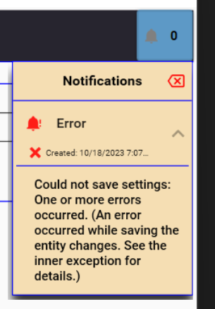
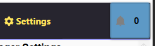
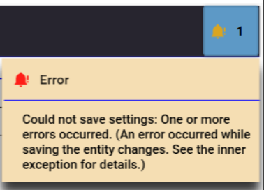
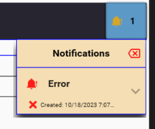
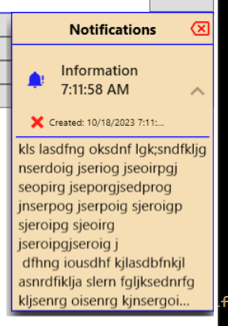
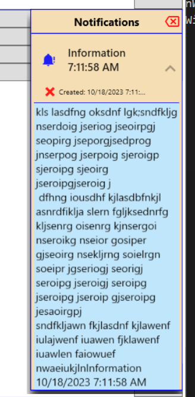

# Wpf.NotificationCenter



## Objective

- Create Toast Notifications
- Create Alerts for the notification Center
- Read previous alerts / toasts in one place.
- Unread indicator
- Customizable

## Contents

- [Installation](#installation)
- [Example Images](#example-images)
- [Customization](#customization)
- [API Documentation](./Help/index.html)
- [Release Notes](#release-notes)

## Installation

### Install NuGet Package (Wpf.NotificationCenter)

Choose one:

- .NET CLI
  - ``` dotnet add package Wpf.NotificationCenter --version 1.0.0 ```
- Package Manager
  - ``` NuGet\Install-Package Wpf.NotificationCenter -Version 1.0.0 ```
- Package Reference
  - ``` <PackageReference Include="Wpf.NotificationCenter" Version="1.*" /> ```
- Paket CLI
  - ``` paket add Wpf.NotificationCenter --version 1.0.0 ```
- Script & Interactive
  - ``` #r "nuget: Wpf.NotificationCenter, 1.0.0" ```
- Cake
  - Install Wpf.NotificationCenter as a Cake Addin
    - ``` #addin nuget:?package=Wpf.NotificationCenter&version=1.0.0 ```
  - Install Wpf.NotificationCenter as a Cake Tool
    - ``` #tool nuget:?package=Wpf.NotificationCenter&version=1.0.0 ```

### App.xaml (Add Theme)

- Include theme resource dictionary

  ``` xaml
  <ResourceDictionary Source="pack://application:,,,/Wpf.NotificationCenter;component/Themes/Generic.xaml" />
  ```

### MainWindow.xaml (Add Notification Center)

- Add namespace
  
  ``` xaml
  xmlns:notificationCenter="clr-namespace:Wpf.NotificationCenter;assembly=Wpf.NotificationCenter"
  ```

- Add Notification Center with content inside.
  
  ``` xaml
  <notificationCenter:NotificationCenter
        x:Name="NotificationCenter"
        VerticalAlignment="Stretch"
        HorizontalAlignment="Stretch"
        NewAlertColor="GoldenRod"
        NoAlertColor="Gray"
        AlertMaxWidth="175"
        MaxNotifications="10"
        BorderBrush="Blue"
        IsItemsAscending="False">
        <notificationCenter:NotificationCenter.Header>
            <!-- Header Content -->
            <c:MainNavMenu Grid.Row="0" Navigate="{Binding DataContext.NavigateCommand, RelativeSource={RelativeSource AncestorType={x:Type c:MainWindow}}}"
                                        ViewContext="{Binding DataContext.ViewContext, RelativeSource={RelativeSource AncestorType={x:Type c:MainWindow}}}" />
        </notificationCenter:NotificationCenter.Header>
        <notificationCenter:NotificationCenter.Content>
            <Grid>
                <!-- Main Content here -->
            </Grid>
        </notificationCenter:NotificationCenter.Content>
  </notificationCenter:NotificationCenter> ```

### App.xaml.cs (update the services collection)

- Add using statement
  
  ``` c#
  using Wpf.NotificationCenter.Extensions;
  ```

- Add the services to the collection:
  
  ``` c#
  services.UseWpfNotificationCenter();
  ```

## Example Images

|                          |                          |
:-------------------------:|:-------------------------:
Notification Center resides in the header. | Toast notifications can be shown.
 | 
Alert center Notification with collapsed message. | Alert center Notification with expanded message.
 | 
An extra long message will automatically be collapsed, indicated by the ellipses. | An extra long message can be expanded by clicking on the collapsed message.
 | 

## Customization

### Notification Center Element Properties

| Property                | Value Type          | Default       | Inherited | Description
:-------------------------|:--------------------|:--------------|:---------:|:-----------
AlertMaxHeight            | Double              | 150           | False     | The alert text content maximum height in the alert center.
AlertMaxWidth             | Double              | Auto          | False     | The alert maximum width property of the notification center popup.
ButtonHorizontalAlignment | HorizontalAlignment | Right         | False     | Indicates the placement of the Alert Center.
BorderBrush               | Brushes             | Transparent   | True      | Used for line colors in notification center and / or headers.
IsItemsAscending          | Boolean             | False         | False     | Indicates the order of alerts in the notification center.
MaxNotifications          | Byte                | 0 (Unlimited) | False     | The upper limit of notifications allowed in the alert center. Oldest are removed when this number is exceeded.
NewAlertColor             | Brushes             | Goldenrod     | False     | Color of the icon when there is a new alert.
NewAlertIcon              | PackIconKind        | BellAlert     | False     | The icon when there is a new alert.
NoAlertColor              | Brushes             | Black         | False     | Color of the icon when there are no unread alerts.
NoAlertIcon               | PackIconKind        | Notifications | False     | The icon when there are no unread alerts.

#### Example

[See usage in main window section.](#mainwindowxaml-add-notification-center)

### Detailed Customization Theme File

Most of the look / feel is defined in the generic.xaml file. Primary theme styles are inherited from the theme of the site.

[Click here to view the theme - generic.xaml](https://raw.githubusercontent.com/cwinland/Wpf.NotificationCenter/master/Wpf.NotificationCenter/Themes/Generic.xaml)

## API Documentation

[API Documentation](./Help/index.html)

## Release Notes

- Initial Release - v.1.0.0
